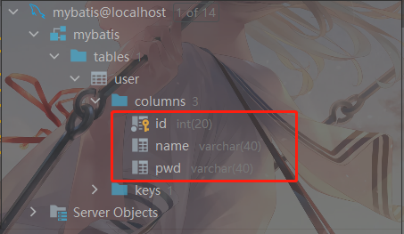
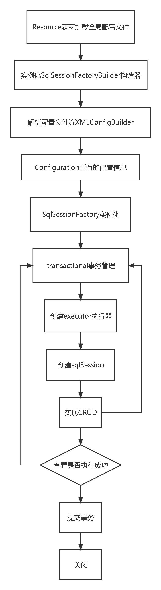

# 1、简介
前置知识体系

- JDBC
- Mysql
- Java基础
- Maven
- JUnit
## 1.1 什么是MyBatis？


- MyBatis 是一款优秀的**持久层框架**。
- 它支持自定义 SQL、存储过程以及高级映射。
- MyBatis 免除了几乎所有的 JDBC 代码以及设置参数和获取结果集的工作。
- MyBatis 可以通过简单的 XML 或注解来配置和映射原始类型、接口和 Java POJO（Plain Old Java Objects，普通老式 Java 对象）为数据库中的记录。
- MyBatis本是apache的一个[开源项目](https://baike.baidu.com/item/%E5%BC%80%E6%BA%90%E9%A1%B9%E7%9B%AE/3406069)iBatis，2010年这个[项目](https://baike.baidu.com/item/%E9%A1%B9%E7%9B%AE/477803)由apache software foundation迁移到了[google code](https://baike.baidu.com/item/google%20code/2346604)，并且改名为MyBatis。
- 2013年11月迁移到[Github](https://baike.baidu.com/item/Github/10145341)。

**如何获取MyBatis？**

- Maven仓库
```xml
<dependency>
  <groupId>org.mybatis</groupId>
  <artifactId>mybatis</artifactId>
  <version>3.5.9</version>
</dependency>
```

- github：[https://github.com/mybatis/mybatis-3](https://github.com/mybatis/mybatis-3)
- 中文文档：[https://mybatis.org/mybatis-3/zh/index.html](https://mybatis.org/mybatis-3/zh/index.html)
## 1.2、持久化
数据持久化

- 持久化就是程序的数据在持久状态和瞬时状态转化的过程
- 内存：**断电即失**
- 数据库（JDBC），io文件持久化
- 生活中：冷藏，罐头。

**为什么需要持久化？**

- 有一些对象，不能让它丢掉
- 内存太贵了
## 1.3、持久层
Dao层、Service层、Controller层......

- 完成持久工作的代码块
- 层的界限十分明显
## 1.4、为什么需要MyBatis？

- 帮助程序员将数据存入数据库中
- 方便
- 传统的JDBC代码太复杂了。简化。框架。自动化。
- 不用MyBatis也能做到。但是更容易上手。
- 优点
   - **简单易学：**本身就很小且简单。没有任何第三方依赖，最简单安装只要两个jar文件+配置几个sql映射文件。易于学习，易于使用。通过文档和源代码，可以比较完全的掌握它的设计思路和实现。
   - **灵活：**mybatis不会对应用程序或者数据库的现有设计强加任何影响。 sql写在xml里，便于统一管理和优化。通过sql语句可以满足操作数据库的所有需求。
   - **解除sql与程序代码的耦合：**通过提供DAO层，将业务逻辑和数据访问逻辑分离，使系统的设计更清晰，更易维护，更易单元测试。sql和代码的分离，提高了可维护性。
   - 提供映射标签，支持对象与数据库的orm字段关系映射。
   - 提供对象关系映射标签，支持对象关系组建维护。
   - 提供xml标签，支持编写动态sql。
# 2、第一个MyBatis程序
思路：搭建环境-->导入MyBatis-->编写代码-->测试
## 2.1、搭建环境
搭建数据库
```sql
create database mybatis;

use mybatis;

create table user(
	id int(20) not null auto_increment,
	name varchar(40) default null,
	pwd varchar(40) default null,
	primary key(id)
)engine = innodb default charset = utf8;

insert into user(id,name,pwd) values
('1','刘大','123456'),
('2','刘二','456789'),
('3','刘三','789456');
```
新建项目

1. 新建一个普通的Maven项目
1. 删掉src作为一个父工程
1. 导入依赖
```xml
<!--导入依赖-->
<dependencies>
    <!--mysql驱动-->
    <dependency>
        <groupId>mysql</groupId>
        <artifactId>mysql-connector-java</artifactId>
        <version>5.1.49</version>
    </dependency>
    <!--mybatis-->
    <dependency>
        <groupId>org.mybatis</groupId>
        <artifactId>mybatis</artifactId>
        <version>3.5.9</version>
    </dependency>
    <!--Junit-->
    <dependency>
        <groupId>junit</groupId>
        <artifactId>junit</artifactId>
        <version>4.13.2</version>
        <scope>test</scope>
    </dependency>
</dependencies>
```
## 2.2、创建一个模块

- 编写Mybatis的核心配置文件		mybatis-config.xml
```xml
<?xml version="1.0" encoding="UTF-8" ?>
<!DOCTYPE configuration
        PUBLIC "-//mybatis.org//DTD Config 3.0//EN"
        "http://mybatis.org/dtd/mybatis-3-config.dtd">
<!--核心配置文件-->
<configuration>
    <environments default="development">
        <environment id="development">
            <transactionManager type="JDBC"/>
            <dataSource type="POOLED">
                <property name="driver" value="com.mysql.jdbc.Driver"/>
                <property name="url" value="jdbc:mysql://localhost:3306/mybatis?useSSL=false&amp;useUnique=true&amp;characterEncoding=utf8"/>
                <property name="username" value="root"/>
                <property name="password" value="1234"/>
            </dataSource>
        </environment>
    </environments>
    <mappers>
        <mapper resource="org/mybatis/example/BlogMapper.xml"/>
    </mappers>
</configuration>
```

- 编写Mybatis工具类
```java
public class MybatisUtils {
    private static SqlSessionFactory sqlSessionFactory;
    static {
        try {
            //使用Mybatis第一步：获取sqlSessionFactory对象
            String resource = "mybatis-config.xml";
            InputStream inputStream = Resources.getResourceAsStream(resource);
            sqlSessionFactory = new SqlSessionFactoryBuilder().build(inputStream);
        } catch (IOException e) {
            e.printStackTrace();
        }
    }
    //既然有了 SqlSessionFactory，顾名思义，我们可以从中获得 SqlSession 的实例。
    //SqlSession 提供了在数据库执行 SQL 命令所需的所有方法。
    public static SqlSession getSqlSession(){
        return sqlSessionFactory.openSession();
    }
}
```
## 2.3、编写代码

- 实体类
```java
public class User {
    private int id;
    private String name;
    private String pwd;

    public User() {
    }

    public User(int id, String name, String pwd) {
        this.id = id;
        this.name = name;
        this.pwd = pwd;
    }

    public int getId() {
        return id;
    }

    public void setId(int id) {
        this.id = id;
    }

    public String getName() {
        return name;
    }

    public void setName(String name) {
        this.name = name;
    }

    public String getPwd() {
        return pwd;
    }

    public void setPwd(String pwd) {
        this.pwd = pwd;
    }

    @Override
    public String toString() {
        return "User{" +
                "id=" + id +
                ", name='" + name + '\'' +
                ", pwd='" + pwd + '\'' +
                '}';
    }
}
```

- Dao接口
```java
public interface UserDao {
    List<User> getUserList();
}
```

- 接口实现类由原来的Impl转换为Mapper配置文件
```xml
<?xml version="1.0" encoding="UTF-8" ?>
<!DOCTYPE mapper
        PUBLIC "-//mybatis.org//DTD Mapper 3.0//EN"
        "http://mybatis.org/dtd/mybatis-3-mapper.dtd">
<!--namespace= 绑定一个对应的Dao/Mapper接口-->
<mapper namespace="com.pink.dao.UserDao">
    <select id="getUserList" resultType="com.pink.pojo.User">
        select * from mybatis.user
    </select>
</mapper>
```
## 2.4、测试
注意点：
org.apache.ibatis.binding.BindingException: Type interface com.pink.dao.UserMapper is not known to the MapperRegistry.

**MapperRegistry**是什么？
核心配置文件中注册Mappers

- Junit测试
```java
@Test
public void test(){
    //获得sql执行对象
    SqlSession sqlSession = MybatisUtils.getSqlSession();

    //执行sql
    UserMapper mapper = sqlSession.getMapper(UserMapper.class);
    List<User> userList = mapper.getUserList();
    for (User user : userList) {
        System.out.println(user);
    }

    //关闭sqlSession
    sqlSession.close();
}
```
#### 可能会遇到的问题

1. 配置文件没有注册
1. 绑定接口错误
1. 方法名不对
1. 返回类型不对
1. Mapper中不能有中文注释
1. Maven导出资源问题
# 3、CRUD
## 3.1、namespace
namespace中的包名要和 Dao/Mapper 接口的包一致！
## 3.2、select
选择，查询语句：

- id：就是对应的namespace中的方法名
- resultType：sql语句执行的返回值
- parameterType：参数类型
1. 编写接口
```java
//根据ID查询用户
User getUserById(int id);
```

2. 编写对应的mapper中的sql
```xml
<select id="getUserById" parameterType="int" resultType="com.pink.pojo.User">
  select * from user where id = #{id}
</select>
```

3. 测试
```java
@Test
public void getUserById(){
    SqlSession sqlSession = MybatisUtils.getSqlSession();
    UserMapper mapper = sqlSession.getMapper(UserMapper.class);
    User user = mapper.getUserById(1);
    System.out.println(user);
    sqlSession.close();
}
```
## 3.3、insert、update、delete

1. 编写接口
```java
//插入一个用户
int addUser(User user);

//修改一个用户
int updateUser(User user);

//删除一个用户
int delUser(int id);
```

2. 编写对应的mapper中的sql
```xml
//对象中的属性，可以直接取出来
<insert id="addUser" parameterType="com.pink.pojo.User">
    insert into user(id,name,pwd) values (#{id},#{name},#{pwd})
</insert>
<update id="updateUser" parameterType="com.pink.pojo.User">
    update user set name = #{name},pwd = #{pwd} where id = 4
</update>
<delete id="delUser" parameterType="com.pink.pojo.User">
    delete from user where id = #{id}
</delete>
```

3. 测试
```java
@Test
public void addUser(){
    SqlSession sqlSession = MybatisUtils.getSqlSession();
    UserMapper mapper = sqlSession.getMapper(UserMapper.class);
    int i = mapper.addUser(new User(4, "刘四", "pwd"));
    if (i>0){
        System.out.println("插入成功!");
    }
    //提交事务
    sqlSession.commit();
    sqlSession.close();
}

@Test
public void updateUser(){
    SqlSession sqlSession = MybatisUtils.getSqlSession();

    UserMapper mapper = sqlSession.getMapper(UserMapper.class);
    int i = mapper.updateUser(new User(4, "刘能", "43512"));
    if (i>0){
        System.out.println("修改成功!");
    }
    sqlSession.commit();
    sqlSession.close();
}
@Test
public void delUser(){
    SqlSession sqlSession = MybatisUtils.getSqlSession();
    UserMapper mapper = sqlSession.getMapper(UserMapper.class);
    int i = mapper.delUser(4);
    if (i>0){
        System.out.println("删除成功");
    }
    sqlSession.commit();
    sqlSession.close();
}
```
## 3.4、分析错误

- 标签不要匹配错误
- resource绑定mapper必须使用路径
- 程序配置文件必须符合规范
- NullpointerException，没有注册到资源
- 输出的xml中文乱码问题，（xml不能有中文注释）
- maven资源没有导出问题
## 3.5、万能的Map
假设我们的实体类，或者数据库中的表，字段或者参数过多，我们应考虑使用map
```java
//万能的Map
int addUser2(Map<String,Object> map);
```
```xml
//对象中的属性，可以直接取出来	传递map的key
<insert id="addUser2" parameterType="map">
    insert into user(id,name,pwd) values (#{userId},#{userName},#{password})
</insert>
```
```java
@Test
public void addUser2(){
    SqlSession sqlSession = MybatisUtils.getSqlSession();
    UserMapper mapper = sqlSession.getMapper(UserMapper.class);

    HashMap<String, Object> map = new HashMap<>();
    map.put("userName","刘能");
    map.put("password","12345");
    int i = mapper.addUser2(map);
    if (i>0){
        System.out.println("插入成功!");
    }
    //提交事务
    sqlSession.commit();
    sqlSession.close();
}
```
Map传递参数，直接在sql中取出key即可！
对象传递参数，直接在sql中取出对象的属性即可！
只有一个基本类型参数的情况下，可以直接在sql中取到！
多个参数用map，**或者注解**
## 3.6、模糊查询

1. Java代码执行的时候，传递通配符%%
```java
List<User> users = mapper.getUserLike("%大%");
```

2. 在sql拼接中使用通配符
```sql
select * from user where name like "%"#{value}"%"
```
# 4、配置解析
## 4.1、核心配置文件

- mybatis-config.xml
- Mybatis的配置文件包含了会深深影响Mybatis行为的设置和属性信息
```xml
configuration（配置）
properties（属性）
settings（设置）
typeAliases（类型别名）
typeHandlers（类型处理器）
objectFactory（对象工厂）
plugins（插件）
environments（环境配置）
environment（环境变量）
transactionManager（事务管理器）
dataSource（数据源）
databaseIdProvider（数据库厂商标识）
mappers（映射器）
```
## 4.2、环境配置（environments）
MyBatis 可以配置成适应多种环境
**不过要记住：尽管可以配置多个环境，但每个 SqlSessionFactory 实例只能选择一种环境。**
要学会使用配置多套运行环境
Mybatis默认的事务管理器就是JDBC，连接池：POOLED
## 4.3、属性（properties）
可以使用properties属性来实现引用配置文件
这些属性可以在外部进行配置，并可以进行动态替换。你既可以在典型的 Java 属性文件中配置这些属性，也可以在 properties 元素的子元素中设置。【db.properties】

编写一个配置文件
db.properties
```properties
driver = com.mysql.jdbc.Driver
url = jdbc:mysql://localhost:3306/mybatis?useSSL=false&useUnique=true&characterEncoding=utf-8
username = root
password = 1234
```
在核心配置文件中引入
```xml
<properties resource="org/mybatis/example/config.properties">
  <property name="username" value="dev_user"/>
  <property name="password" value="F2Fa3!33TYyg"/>
</properties>
```

- 可以直接引入外部文件
- 可以在其中增加一些属性配置
- 如果这两边有同一个字段，优先使用外部配置文件中的！
## 4.4、类型别名（typeAliases）

- 类型别名可为 Java 类型设置一个缩写名字
- 意在降低冗余的全限定类名书写
```xml
<!--可以给实体类起别名-->
<typeAliases>
    <typeAlias alias="User" type="com.pink.pojo.User"/>
</typeAliases>
```
也可以指定一个包名，MyBatis 会在包名下面搜索需要的 Java Bean，比如：
扫描实体类的包，它的默认别名就为这个类的类名首字母小写！
```xml
<typeAliases>
    <package name="com.pink.pojo"/>
</typeAliases>
```
在实体类少的时候，使用第一种方式。
如果实体类比较多的话，建议使用第二种。
第一种别名可以DIY，第二种则不行，如果非要改，则在实体类中加入注解
```java
@Alias("user")
public class User {}
```
## 4.5、设置（settings）
这是 MyBatis 中极为重要的调整设置，它们会改变 MyBatis 的运行时行为
## 4.6、其他配置

- typeHandlers（类型处理器）
- objectFactory（对象工厂）
- plugins（插件）
   - mybatis-generator-core
   - mybatis-plus
## 4.7、映射器（mappers）
**MapperRegistry： **注册绑定Mapper文件
方式一：使用相对于类路径的资源引用
```xml
<mappers>
    <mapper resource="com/pink/dao/UserMapper.xml"/>
</mappers>
```
方式二：使用class文件绑定注册
```xml
<mappers>
    <!--<mapper resource="com/pink/dao/UserMapper.xml"/>-->
    <mapper class="com.pink.dao.UserMapper"/>
</mappers>
```
注意点：

- 接口与其Mapper配置文件必须同名
- 接口与其Mapper配置文件必须在同一包下

方式三：使用扫描包进行注入
```xml
<mappers>
    <!--<mapper resource="com/pink/dao/UserMapper.xml"/>-->
    <!--<mapper class="com.pink.dao.UserMapper"/>-->
    <package name="com.pink.dao"/>
</mappers>
```
## 4.8、作用域（Scope）和生命周期

作用域和生命周期类别是至关重要的，因为错误的使用会导致非常严重的**并发问题**。
**SqlSessionFactoryBuilder：**

- 一旦创建了 SqlSessionFactory，就不再需要它了
- 局部变量

**SqlSessionFactory：**

- 本质就是数据库连接池
- SqlSessionFactory 一旦被创建就应该在应用的运行期间一直存在，**没有任何理由丢弃它或重新创建另一个实例**
- 因此 SqlSessionFactory 的最佳作用域是应用作用域
- 最简单的就是使用**单例模式**或者静态单例模式

**SqlSession：**

- 连接到连接池的一个请求！
- SqlSession 的实例不是线程安全的，因此是不能被共享的，所以它的最佳的作用域是请求或方法作用域
- 用完之后需要赶紧关闭


这里面的每一个Mapper，就代表一个具体的业务
# 5、解决属性名和字段名不一致的问题
## 5.1、问题
数据库中的字段

新建项目测试
```java
public class User {
    private int id;
    private String name;
    private String password;
}
```
测试结果：

解决方法：

- 起别名
```xml
<select id="getUserById" parameterType="int" resultType="com.pink.pojo.User">
    select id,name,pwd as password from user where id = #{id}
</select>
```
## 5.2、resultMap
结果集映射
```bash
id	name	pwd
id	name	password
```
```xml
<!--column:数据库中字段，property:实体类中的属性-->
<resultMap id="UserMap" type="User">
    <result column="id" property="id"/>
    <result column="name" property="name"/>
    <result column="pwd" property="password"/>
</resultMap>
<select id="getUserById" resultMap="UserMap">
    select * from user where id = #{id}
</select>
```

- resultMap 元素是 MyBatis 中最重要最强大的元素
- ResultMap 的设计思想是，对简单的语句做到零配置，对于复杂一点的语句，只需要描述语句之间的关系就行了
- 这就是 ResultMap 的优秀之处——你完全可以不用显式地配置它们
# 6、日志
## 6.1、日志工厂
如果一个数据库操作，出现了异常，我们需要排错。日志就是最好的帮手！


- SLF4J
- LOG4J(deprecated since 3.5.9) 【掌握】
- LOG4J2
- JDK_LOGGING
- COMMONS_LOGGING 
- STDOUT_LOGGING	【掌握】
- NO_LOGGING

在Mybatis中具体使用哪个日志提现，在设置中设定
**STDOUT_LOGGING 标准日志输出**
在Mybatis核心配置文件中配置日志
```xml
<settings>
    <setting name="logImpl" value="STDOUT_LOGGING"/>
</settings>
```
输出：

## 6.2、log4j
什么是log4j？

- Log4j是[Apache](https://baike.baidu.com/item/Apache/8512995)的一个开源项目，通过使用Log4j，我们可以控制日志信息输送的目的地是[控制台](https://baike.baidu.com/item/%E6%8E%A7%E5%88%B6%E5%8F%B0/2438626)、文件、[GUI](https://baike.baidu.com/item/GUI)组件。
- 我们也可以控制每一条日志的输出格式；
- 通过定义每一条日志信息的级别，我们能够更加细致地控制日志的生成过程。
- 通过一个[配置文件](https://baike.baidu.com/item/%E9%85%8D%E7%BD%AE%E6%96%87%E4%BB%B6/286550)来灵活地进行配置，而不需要修改应用的代码。

1、先导入log4j的包
```xml
<!-- https://mvnrepository.com/artifact/log4j/log4j -->
        <dependency>
            <groupId>log4j</groupId>
            <artifactId>log4j</artifactId>
            <version>1.2.17</version>
        </dependency>
```
2、log4j.properties
```properties
# set log levels
log4j.rootLogger=DEBUG,console,file
# 输出到控制台
log4j.appender.console=org.apache.log4j.ConsoleAppender
log4j.appender.console.Target=System.out
log4j.appender.console.Threshold=DEBUG
log4j.appender.console.layout=org.apache.log4j.PatternLayout
log4j.appender.console.layout.ConversionPattern=【%c】-%m%n
# 文件输出的相关设置
log4j.appender.file=org.apache.log4j.RollingFileAppender
log4j.appender.file.File=./log/pink.log
log4j.appender.file.MaxFileSize=10mb
log4j.appender.file.Threshold=DEBUG
log4j.appender.file.layout=org.apache.log4j.PatternLayout
log4j.appender.file.layout.ConversionPattern=【%p】【%d{yy-MM-dd}】【%c】%m%n
# 日志输出级别
log4j.logger.org.mybatis=DEBUG
log4j.logger.java.sql=DEBUG
log4j.logger.java.sql.Statement=DEBUG
log4j.logger.java.sql.ResultSet=DEBUG
log4j.logger.java.sql.PreparedStatement=DEBUG
```
3、配置log4j为日志的实现
```xml
<settings>
    <setting name="logImpl" value="LOG4J"/>
</settings>
```
4、log4j的使用

**简单使用**

1. 在要使用log4j的类中，导入包  import org.apache.log4j.Logger;
1. 日志对象，参数为当前类的class
```java
static Logger logger = Logger.getLogger(UserMapperTest.class);
```

3. 日志级别
```java
logger.info("info:进入了log4j");
logger.debug("debug:进入了log4j");
logger.error("error:进入了log4j");
```
# 7、分页
为什么要分页？

- 减少数据的处理量

## 7.1、使用limit分页
```sql
-- 语法：
select * from user limit startIndex,pageSize;
select * from user limit 3; --[0.3]
```
使用Mybatis实现分页，核心就是sql

1. 接口
```java
//分页查询
List<User> getUserByLimit(Map<String,Integer> map);
```

2. Mapper.xml
```xml
<select id="getUserByLimit" parameterType="map" resultType="User">
    select * from user limit #{startIndex},#{pageSize}
</select>
```

3. 测试
```java
@Test
public void getUserByLimit(){
    SqlSession sqlSession = MybatisUtils.getSqlSession();
    UserMapper mapper = sqlSession.getMapper(UserMapper.class);
    HashMap<String, Integer> map = new HashMap<String,Integer>();
    map.put("startIndex",0);
    map.put("pageSize",2);
    List<User> users = mapper.getUserByLimit(map);
    for (User user : users) {
        System.out.println(user);
    }
    sqlSession.close();
}
```
## 7.2、RowBounds分页
不再使用sql实现

1. 接口
```java
List<User> getUserByRowBounds();
```

2. Mapper.xml
```xml
<select id="getUserByRowBounds" resultMap="UserMap">
    select * from user
</select>
```

3. 测试
```java
@Test
public void getUserByRowBounds(){
    SqlSession sqlSession = MybatisUtils.getSqlSession();
    //RowBounds实现

    RowBounds rowBounds = new RowBounds(0, 2);
    //通过java代码层面实现分页
    List<User> userList = sqlSession.selectList("com.pink.dao.UserMapper.getUserByRowBounds",null,rowBounds);
    for (User user : userList) {
        System.out.println(user);
    }
    sqlSession.close();
}
```
## 7.3、分页插件
[https://pagehelper.github.io/](https://pagehelper.github.io/)


# 8、使用注解开发
## 8.1、面象接口编程

-  大家之前都学过面向对象编程，也学习过接口，但在真正的开发中，很多时候我们会选择面向接口编程 
-  **根本原因：解耦，可拓展，提高复用，分层开发中，上层不用管具体的实现，大家都遵守共同的标准，使得开发变得更容易，规范性更好** 
-  在一个面向对象的系统中，系统的各种功能是由许许多多的不同对象协作完成的。在这种情况下，各个对象内部是如何实现自己的，对系统设计人员来讲就不那么重要了； 
-  而各个对象之前的协作关系则成为系统设计的关键，小到不同类之间的通信，大到各模块之间的交互，在系统设计之初都是要着重考虑的，这也是系统设计的主要工作内容，面向接口编程就是指按照这种思想来编程。

**关于接口的理解** 

-  接口从更深层次的理解，应是定义（规范，约束）与实现（名实分离）的分离。 
-  接口的本身反映了系统设计人员对系统的抽象理解。 
-  接口应有两类： 
   - 第一类是对一个个体的抽象，它可对应为一个抽象体(abstract class);
   - 第二类是对一个个体某一方面的抽象，即形成一个抽象面(interface)；
-  一个体有可能有多个抽象面，抽象体与抽象面是有区别的 

**三个面向区别**

- 面向对象是指，我们考虑问题时，以对象为单位，考虑它的属性及方法
- 面向过程是指，我们考虑问题时，以一个具体的流程(事务过程)为单位，考虑它的实现。
- 接口设计与非接口设计是针对复用技术而言的，与面向对象(过程)不是一个问题，更多的体现就是对系统整体的架构
## 8.2、使用注解开发

1. 注解在接口上实现
```java
@Select("select * from user")
List<User> getUsers();
```

2. 需要在核心配置文件中绑定接口
```xml
<!--绑定接口-->
<mappers>
    <mapper class="com.pink.dao.UserMapper"/>
</mappers>
```

3. 测试

本质：反射机制实现
底层：动态代理

**Mybatis详细执行流程**

## 8.3、CRUD

1. 可以在创建工具类的时候实现自动提交事务
```java
public static SqlSession getSqlSession(){
    return sqlSessionFactory.openSession(true);
}
```

2. 编写接口，增加注解
```java
@Select("select * from user")
List<User> getUsers();

//方法存在多个参数，所有的参数前面必须加上@Param注解
@Select("select * from user where id = #{id}")
User getUserById(@Param("id") int id);

@Insert("insert into user(id,name,pwd) values (#{id},#{name},#{password})")
int addUser(User user);

@Update("update user set name = #{name},pwd = #{password} where id = #{id}")
int updateUser(User user);

@Delete("delete from user where id = #{id}")
int deleteUser(@Param("id") int id);
```

3. 测试类

【注意：必须要将接口注册绑定到核心配置文件中】

**关于@Param注解**

- 基本数据类型参数或者String类型，需要加上
- 引用类型不需要加
- 如果只有一个基本类型的话，可以忽略，但是建议都加上
- 在sql中引用的就是Param中设定的属性名

**#{}和${}的区别**

# 9、Lombok
使用步骤：

1. 在IDEA中安装Lombok插件
1. 在项目中导入Lombok的jar包
```xml
<!-- https://mvnrepository.com/artifact/org.projectlombok/lombok -->
<dependency>
    <groupId>org.projectlombok</groupId>
    <artifactId>lombok</artifactId>
    <version>1.18.22</version>
    <scope>provided</scope>
</dependency>
```

3. 在实体类上加注解即可！
```java
@Data
@AllArgsConstructor
@NoArgsConstructor
public class User {}
```
# 10、多对一处理

- 多个学生，对应一个老师
- 对于学生而言，关联，多个学生，关联一个老师【多对一】【association】
- 对于老师而言，集合，一个老师，有很多学生【一对多】【collection】


```sql
CREATE TABLE `teacher` (
  `id` INT(10) NOT NULL,
  `name` VARCHAR(30) DEFAULT NULL,
  PRIMARY KEY (`id`)
) ENGINE=INNODB DEFAULT CHARSET=utf8

INSERT INTO teacher(`id`, `name`) VALUES (1, '秦老师'); 

CREATE TABLE `student` (
  `id` INT(10) NOT NULL,
  `name` VARCHAR(30) DEFAULT NULL,
  `tid` INT(10) DEFAULT NULL,
  PRIMARY KEY (`id`),
  KEY `fktid` (`tid`),
  CONSTRAINT `fktid` FOREIGN KEY (`tid`) REFERENCES `teacher` (`id`)
) ENGINE=INNODB DEFAULT CHARSET=utf8

INSERT INTO `student` (`id`, `name`, `tid`) VALUES ('1', '小明', '1'); 
INSERT INTO `student` (`id`, `name`, `tid`) VALUES ('2', '小红', '1'); 
INSERT INTO `student` (`id`, `name`, `tid`) VALUES ('3', '小张', '1'); 
INSERT INTO `student` (`id`, `name`, `tid`) VALUES ('4', '小李', '1'); 
INSERT INTO `student` (`id`, `name`, `tid`) VALUES ('5', '小王', '1');
```

1. **测试环境搭建**
1. 导入Lombok
1. 创建实体类 Teacher，Student
1. 创建Mapper接口
1. 创建Mapper.xml文件
1. 在核心配置文件中绑定Mapper接口
1. 测试查询是否能够成功！

2. **按照查询嵌套处理**
```xml
<!--
思路:
    1.查询所有的学生信息
    2.根据查询出来的学生的tid，寻找对应的老师！       子查询
-->
<resultMap id="StudentTeacher" type="Student">
    <result property="id" column="id"/>
    <result property="name" column="name"/>
    <!--复杂的属性，我们需要单独处理,对象:association;集合:collection-->
    <association property="teacher" column="tid" javaType="teacher" select="getTeachers"/>
</resultMap>
<select id="getStudents" resultMap="StudentTeacher">
    /*select s.id as '学生id',s.name as '学生姓名',t.name as '老师' from student s,teacher t where s.tid = t.id*/
    select * from student
</select>
<select id="getTeachers" resultType="Teacher">
    select * from teacher where id = #{id}
</select>
```

3. **按照结果嵌套处理**
```java
<select id="getStudents2" resultMap="StudentTeacher2">
    select s.id as '学生id',s.name as '学生姓名',t.name as '老师'
    from student s,teacher t
    where s.tid = t.id
</select>
<resultMap id="StudentTeacher2" type="Student">
    <result property="id" column="学生id"/>
    <result property="name" column="学生姓名"/>
    <association property="teacher" javaType="Teacher">
        <result property="name" column="老师"/>
    </association>
</resultMap>
```

4. 回顾Mysql多对一查询方式：
- 子查询
- 联表查询
# 11、一对多处理
比如：一个老师拥有多个学生！
对于老师而言，就是一对多的关系

1. 环境搭建，同上
```java
@Data
public class Student {
    private int id;
    private String name;
    private int tid;
}


@Data
public class Teacher {
    private int id;
    private String name;

    //一个老师拥有多个学生
    private List<Student> students;
}
```

2. **按照查询嵌套处理**
```xml
<select id="getTeachers3" resultMap="TeacherStudent2">
    select * from teacher where id = #{tid}
</select>
<resultMap id="TeacherStudent2" type="Teacher">
    <result property="id" column="id"/>
    <result property="name" column="name"/>
    <collection property="students" column="id" ofType="Student" select="getStudents"/>
</resultMap>
<select id="getStudents" resultType="Student">
    select * from student where tid = #{id}
</select>
```

3. **按照结果嵌套查询**
```xml
<select id="getTeachers2" resultMap="TeacherStudent">
    select t.id '老师id',t.name '老师姓名',s.id '学生id',s.name '学生姓名',s.tid tid
    from student s,teacher t
    where s.tid = t.id and tid = #{tid}
</select>
<resultMap id="TeacherStudent" type="Teacher">
    <result property="id" column="老师id"/>
    <result property="name" column="老师姓名"/>
    <collection property="students" ofType="Student">
        <result property="id" column="学生id"/>
        <result property="name" column="学生姓名"/>
        <result property="tid" column="tid"/>
    </collection>
</resultMap>
```
**小结**

1. 关联 - association 【多对一】
1. 集合 - collection 【一对多】
1. javaType	&   ofType
   1. javaType 用来指定实体类中属性的类型
   1. ofType  用来指定映射到List或者集合中得到pojo类型，泛型中的约束类型

**注意点**

1. 保证sql的可读性，尽量保证通俗易懂
1. 注意一对多和多对一中，属性名和字段的问题！
1. 如果问题不好排查错误，可以使用日志，建议使用Log4j

**面试高频**

- Mysql引擎
- InnoDB底层原理
- 索引
- 索引优化
# 12、动态SQL
**什么是动态SQL？动态SQL就是指根据不同的条件生成不同的SQL语句。**
**利用动态SQL这一特性可以彻底摆脱这种痛苦**
```xml
如果你之前用过 JSTL 或任何基于类 XML 语言的文本处理器，你对动态 SQL 元素可能会感觉似曾相识。
在 MyBatis 之前的版本中，需要花时间了解大量的元素。
借助功能强大的基于 OGNL 的表达式，MyBatis 3 替换了之前的大部分元素，
大大精简了元素种类，现在要学习的元素种类比原来的一半还要少。

if
choose (when, otherwise)
trim (where, set)
foreach
```
## 12.1、搭建环境
创建一个基础工程

1. 导包
1. 编写配置文件
1. 编写实体类
```java
@Data
public class Blog {
    private String id;
    private String title;
    private String author;
    private Date createTime;
    private int views;
}
```

4. 编写实体类对应Mapper接口及Mapper.xml文件
## 12.2、IF
```xml
<select id="queryBlogIf" parameterType="map" resultType="Blog">
    select * from blog
    where 1=1
    <if test="title!=null">
        and title like #{title}
    </if>
    <if test="author!=null">
        and author like #{author}
    </if>
</select>
```
## 12.3、choose (when, otherwise)
```xml
<select id="queryBlogChoose" parameterType="map" resultType="Blog">
    select * from blog where 1=1
    <choose>
        <when test="title!=null">
            and title like #{title}
        </when>
        <when test="author!=null">
            and author like #{author}
        </when>
        <otherwise>
            and views = #{views}
        </otherwise>
    </choose>
</select>
```
## 12.4、trim (where, set)
```xml
<select id="queryBlogTrim" parameterType="map" resultType="Blog">
  select * from blog
  <where>
  <!--<trim prefix="where" prefixOverrides="and|or">-->
      <if test="title!=null">
          and title like #{title}
      </if>
      <if test="author!=null">
          and author like #{author}
      </if>
      <if test="views!=null">
          and views like #{views}
      </if>
  </where>
  <!--</trim>-->
</select>
```
```xml
<update id="updateBlogSet" parameterType="map">
  update blog
  <!--<set>-->
    <trim prefix="set" suffixOverrides=",">
      <if test="title!=null">author=#{author},</if>
      <if test="title!=null">views=#{views},</if>
  <!--</set>-->
    </trim>
  where title like #{title}
</update>
```

## 12.5、SQL片段
有时候，把一些重复的sql抽取出来，方便复用！

1. 使用SQL标签抽取公共的部分
```xml
<sql id="if-title-author">
    <if test="title!=null">
        and title like #{title}
    </if>
    <if test="author!=null">
        and author like #{author}
    </if>
</sql>
```

2. 在需要使用的地方加上include标签即可
```xml
<select id="queryBlogIf" parameterType="map" resultType="Blog">
    select * from blog
    <where>
    <include refid="if-title-author"/>
    </where>
</select>
```
注意事项：

- 最好基于单表来定义SQL片段
- 不要存在where标签
## 12.6、Foreach
动态 SQL 的另一个常见使用场景是对集合进行遍历（尤其是在构建 IN 条件语句的时候）。比如：
```xml
<select id="selectPostIn" resultType="domain.blog.Post">
  SELECT *
  FROM POST P
  <where>
    <foreach item="item" index="index" collection="list"
        open="ID in (" separator="," close=")" nullable="true">
          #{item}
    </foreach>
  </where>
</select>

select * from post where id in(1,2,3,4,5)
```
```xml
<select id="queryBlogForeach" parameterType="map" resultType="Blog">
    select * from blog
    <where>
        <foreach collection="ids" item="id" open="(" close=")" separator="or">
            id = #{id}
        </foreach>
    </where>
</select>
```
```java
@Test
public void queryBlogForeach(){
    SqlSession sqlSession = MybatisUtils.getSqlSession();
    BlogMapper mapper = sqlSession.getMapper(BlogMapper.class);
    HashMap<String,Object> map = new HashMap<String,Object>();
    ArrayList<Integer> ids = new ArrayList<Integer>();
    ids.add(1);
    ids.add(2);
    ids.add(3);
    map.put("ids",ids);
    List<Blog> blogs = mapper.queryBlogForeach(map);
    for (Blog blog : blogs) {
        System.out.println(blog);
    }
    sqlSession.close();
}
```

## 12.7、总结
动态SQL就是在拼接SQL语句，只要保证SQL的正确性，按照SQL的格式，去排列组合即可！
建议：

- 先在数据库中写出完整的SQL，再对应的去修改成为动态SQL实现即可！
# 13、缓存
## 13.1、简介
```xml
查询：意味着连接数据库-->耗资源

    一次查询的结果，暂存在一个可以直接取到的地方--->内存： 缓存

再次查询相同的数据的时候，直接走缓存，就不用走数据库了
```

1. 什么是缓存【cache】?
   1. 存在内存中的临时数据
   1. 将用户经常查询的数据放入缓存【内存】中，用户去查询数据就不用从磁盘上【关系型数据库数据文件】查询，从缓存中查询，从而提升查询效率，解决了高并发系统的性能问题。
2. 为什么使用缓存？
   1. 减少和数据库的交互次数，减少系统开销，提高系统效率
3. 什么样的数据能使用缓存？
   1. 经常查询且不经常改变的数据
## 13.2、Mybatis缓存

- Mybatis包含一个非常强大的查询缓存特性，它可以非常方便的定制和配置缓存。缓存可以极大的提升查询效率
- Mybatis系统中默认定义了两级缓存：【一级缓存】和【二级缓存】
   - 默认情况下，只有一级缓存开启。（SqlSession级别的缓存，也称为本地缓存）
   - 二级缓存需要手动开启和配置，它是基于namespace级别的缓存。
   - 为了提高扩展性，Mybatis定义了缓存接口Cache。可以通过实现Cache接口来自定义二级缓存。
## 13.3、一级缓存

- 一级缓存也叫本地缓存：SqlSession
   - 与数据库同一次会话期间查询到的数据会放在本地缓存中。
   - 以后如果需要获取相同的数据，直接从缓存中拿，没必要再去查询数据库。
- 测试步骤：
   - 开启日志！
   - 测试在一个Session中查询两次相同记录
   - 查看日志输出


- 缓存失效的情况：
   - 查询不同东西
   - 增删改操作，可能会改变原来的数据，所以必定会刷新缓存
   - 查询不同的Mapper.xml
```java
@Test
public void queryUserById(){
    SqlSession sqlSession = MybatisUtils.getSqlSession();
    UserMapper mapper = sqlSession.getMapper(UserMapper.class);
    User user = mapper.queryUserById(1);
    System.out.println(user);
    System.out.println("--------------------------------");
    mapper.updateUser(new User(6, "老六", "123456"));
    System.out.println("--------------------");
    User user3 = mapper.queryUserById(1);
    System.out.println(user3);
    System.out.println(user==user3); //false
    sqlSession.close();
}
```

   - 手动清理缓存！
      - sqlSession.clearCache();

**小结：**一级缓存默认是开启的，只在一次SqlSession中有效，也就是拿到连接到关闭连接这个区间段！
一级缓存就是一个Map
## 13.4、二级缓存

- 二级缓存也叫全局缓存，一级缓存作用域太低了，所以诞生了二级缓存
- 基于namespace级别的缓存，一个名称空间，对应一个二级缓存
- 工作机制
   - 一个会话查询一个数据，这个数据就会被放在当前会话的一级缓存中。
   - 如果当前会话关闭了，这个会话对应的一级缓存就没了；但我们想要的是，一级缓存中的数据被保存到二级缓存中；
   - 新的会话查询信息，就可以在二级缓存中获取内容
   - 不同的mapper查出的数据会放在自己对应的缓存【map】中。
- 步骤：
   - 开启器全局缓存
```xml
<!--显式的开启全局缓存-->
<setting name="cacheEnabled" value="true"/>
```

   - 在使用二级缓存的Mapper中开启
```xml
<cache/>
```

   - 也可以自定义参数  
```xml
<!--在当前的Mapper.xml中使用二级缓存-->
<cache
    eviction="FIFO"
    flushInterval="60000"
    size="512"
    readOnly="true"/>
```

   - 测试
      - 问题：我们需要将实体类序列化！否则会报错！
```xml
Caused by: java.io.NotSerializableException: com.pink.pojo.User
```

      - 只要定义了readOnly="true"也可以不用序列化
> readOnly（只读）属性可以被设置为 true 或 false。只读的缓存会给所有调用者返回缓存对象的相同实例。 因此这些对象不能被修改。这就提供了可观的性能提升。而可读写的缓存会（通过序列化）返回缓存对象的拷贝。 速度上会慢一些，但是更安全，因此默认值是 false。
意思就是<cache/>默认readOnly = false，所以要求缓存对象必须支持序列化。

- 小结
   - 只要开启了二级缓存，在同一个Mapper下就有效
   - 所有的数据都会先放在一级缓存中
   - 只有当会话提交，或者关闭的时候，才会提交到二级缓存
## 13.5、缓存原理

## 13.6、自定义缓存Ehcache

- Ehcache是一种广泛使用的开源Java分布式缓存。主要面向通用缓存
- 要在程序中使用Ehcache，要先导包！
```xml
<!-- https://mvnrepository.com/artifact/org.mybatis.caches/mybatis-ehcache -->
<dependency>
    <groupId>org.mybatis.caches</groupId>
    <artifactId>mybatis-ehcache</artifactId>
    <version>1.2.2</version>
</dependency>
```
在mapper中指定使用ehcache缓存实现！
```xml
<cache type="org.mybatis.caches.ehcache.EhcacheCache"/>
```
ehcache.xml
```xml
<?xml version="1.0" encoding="UTF-8"?>
<ehcache xmlns:xsi="http://www.w3.org/2001/XMLSchema-instance"
         xsi:noNamespaceSchemaLocation="https://ehcache.org/ehcache.xsd"
         updateCheck="false">
    <!--
        diskStore:  为缓存路径，ehcache分为内存和磁盘两级，此属性定义磁盘的缓存位置，参数解释如下:
        user.home   - 用户主目录
        user.dir    - 用户当前工作目录
        java.io.tmpdir  - 默认临时文件路径
    -->
    <diskStore path="./tmpdir/Tmp_EhCache"/>

    <defaultCache
        eternal="false"
        maxElementsInMemory="10000"
        overflowToDisk="false"
        diskPersistent="false"
        timeToIdleSeconds="1800"
        timeToLiveSeconds="259200"
        memoryStoreEvictionPolicy="LRU"/>
    <cache
        name="cloud_user"
        eternal="false"
        maxElementsInMemory="5000"
        overflowToDisk="false"
        diskPersistent="false"
        timeToIdleSeconds="1800"
        timeToLiveSeconds="1800"
        memoryStoreEvictionPolicy="LRU"/>
    <!--
        defaultCache:   默认缓存策略，当ehcache找不到定义的缓存时，则使用这个缓存策略。只能定义一个
    -->
</ehcache>
```

